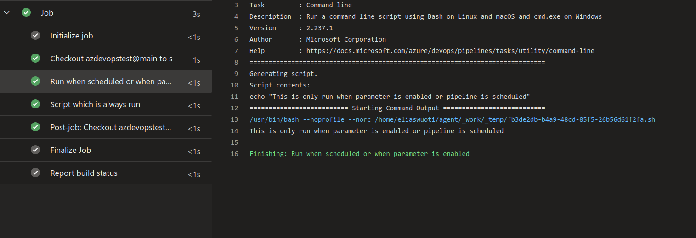

Let's say you are using Azure DevOps and have a pipeline to which you have [applied a schedule](https://learn.microsoft.com/en-us/azure/devops/pipelines/process/scheduled-triggers?view=azure-devops&tabs=yaml):

```yaml
schedules:
- cron: '0 0 * * *'
  displayName: Daily midnight build
  branches:
    include:
    - main
```

Maybe it's your nightly build, maybe it's used for testing.


But you also have parameters in the pipeline:

```yaml
parameters:
- name: enableFeature
  type: boolean
  default: false
```

The trouble is, now when the pipeline is executed nightly it runs with default parameters.
Even worse, if the parameter values you want for your scheduled build are inconvenient for regular builds, now other pipeline users must change the parameters from the scheduled defaults every time they run the pipeline.

And at some point they *will* forget to change those. And depending on the duration of the pipeline, you've just wasted (quite) many minutes of their time for a non-relevant build.

Example: You have a (boolean) parameter which:

- needs to be disabled when running a manual build
- needs to be enabled when running a nightly scheduled build

So how to keep the scheduled version of your pipeline not messing up your current setup?

The answer is to break out the best (or worst) part of YAML: template logic.

```yaml
- ${{ if or(eq(parameters.enableFeature, true), eq(variables['Build.Reason'], 'Schedule')) }}:
```

The full pipeline code now looks like the following:

```yaml
schedules:
- cron: '0 0 * * *'
  displayName: Daily midnight build
  branches:
    include:
    - main

pool:
  vmImage: ubuntu-latest

parameters:
- name: enableFeature
  type: boolean
  default: false

steps:
- ${{ if or(eq(parameters.enableFeature, true), eq(variables['Build.Reason'], 'Schedule')) }}:
  - script: |
      echo "This is only run when parameter is enabled or pipeline is scheduled"
    displayName: 'Run when scheduled or when parameter is enabled'

- script: |
    echo "This is always run"
  displayName: 'Script which is always run'
```

Executing it manually gives us the following results:

Now the CI job itself triggered after commit does not have the parameter enabled


But when the schedule triggers, you get this:




----

And lastly: [crontab.guru](https://crontab.guru/) is rather helpful when setting up a schedule.
