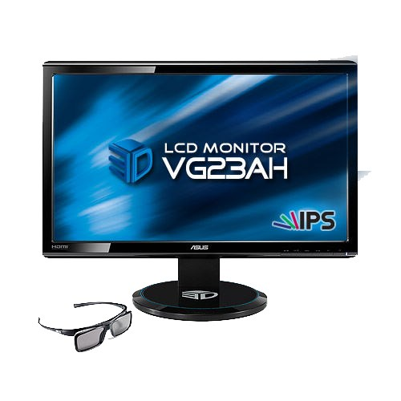

<!-- markdownlint-disable line-length -->


## Why overclock your monitor in the first place?

Disclaimer: (Your retailer or manufacturer likely won't have a lot of sympathy for broken monitors caused by pushing the pixel clocks and refresh rates too far by bypassing their limitations.)

For the longest time of LCDs, most computer monitors have had their refresh rates capped at 60 Hz, even though they could do some more. How much more, well it depends on your display. ~10 years before, it was really rare to see IPS screens with high refresh rates. But there were options: either buy [Korean IPS panels](https://www.overclock.net/threads/long-term-reliability-of-korean-ips.1390265/), pray that your customs agent lets them through. OR alternatively get a monitor where the manufacturer left a little headroom, either intentionally or not.

One such monitor was Asus' VG23AH, a 23-inch 1080p monitor with a semi-glossy coating, [see forum post here](https://hardforum.com/threads/asus-vg23ah-the-1st-semi-glossy-ips-panel.1701734/). And passive 3D support as well, how early 2010s!



But the best part was this: despite being an IPS panel, it could be overclocked up to 76 Hz.

Along the forums and YouTube videos, there were instructions on how to setup custom resolutions with Nvidia control panel, along with creating a custom monitor driver using PowerStrip (to force games to use those resolutions). But that was on Windows. How to achieve the same on Linux? Well, you'll need to start tweaking your `Xorg.conf` file. Let's take a look.

## Creating a custom resolution

First, check info on your current display:

```bash
$ xrandr -q
```

This should give you the name of your monitor detected by X, along with a list of various resolutions. In the case of Asus, we have a very standard 1920x1080 at 60 Hz. Also, a mode for 76 Hz 1080p missing, which is the monitor fooling you. It can do better, but first we'll have to calculate a **modeline**. In short, modelines contain the information on various timings, which in turn tells the display driver how to refresh the pixels.

#### Calculate a modeline

To calculate a modeline, use the `cvt` command line tool. Or alternatively, use [video timings calculator](https://tomverbeure.github.io/video_timings_calculator) to get more detailed information on the modeline (such as required bandwidth).

In this case, we're going with a 1920 by 1080 resolution at 72 Hz.

After inputting those values to the tool, we get the following modeline:

```conf
Modeline        "1920x1080_71.91" 210.25 1920 2056 2256 2592 1080 1083 1088 1128 -hsync +vsync 
```

> NOTE: addition to the regular modeline, you also have 2 other optionns, `CVT-RB` and `CVT-RBv2`. The `RB` stands for Reduced Blanking, which effectively allows you to transfer more data with a lower bandwidth. However, RB was made part of HDMI 2.0, so you'll need a fairly recent display to take advantage of that. In this case, my VG23AH is out of luck.

[Read more on video modes and modelines here.](https://www.improwis.com/tables/video.webt#Videomodesandmodelines)

[This is where I got the info on Nvidia driver settings for Linux monitor overclocking.](https://www.monitortests.com/forum/Thread-Guide-to-Nvidia-monitor-overclocking-on-Linux)

#### Test your custom resolution

Let's take the custom modeline and apply it to our monitor.

First, we add the mode for X display server.

```bash
xrandr --newmode  "1920x1080_71.91" 210.25 1920 2056 2256 2592 1080 1083 1088 1128 -hsync +vsync 
```
Then, we'll add it as an available mode for your specific monitor (in this case for `HDMI-1`). 
```bash
xrandr --addmode HDMI-1 1920x1080_71.91
```

Lastly, we'll set our new mode as the active mode, changing the current resolution to the newly customized one.

```bash
xrandr --output VGA-1 --mode 1600x1200_60.00
```

After running `xrandr --output`, chances are you'll get a black screen. This indicates that your monitor refuses to support that specific resolution. But in this case, we **know** that it's supposed to work, it's already been proved on Windows.

So what to do now? Get your wrench and use a little force. Here's how.


## X configuration

Now we arrive at the tedious bit, which is modifying your X configuration. Check if you already have `/etc/X11/xorg.conf`. If not, create it first.

#### Ignore manufacturer EDID

To force your custom resolution on Linux, you'll need to ignore the default EDID ([Extended Display Identification Data](https://en.wikipedia.org/wiki/Extended_Display_Identification_Data)) used. Display manufacturers specify various information on their displays inside the EDID, including which refresh rates should be supported by the panel.

If you're using Nvidia proprietary drivers, you can specify: 

```conf
Section "Device"
    Option      "UseEDIDFreqs"  "false"
```

to disable the driver comparing your resolution against the allowed ones in the EDID.

You'll also need to disable some other options, such as maximum pixel clock. 
TODO: explain HorizSync and VertRefresh!

In the `device` section, ensure you have this:

```conf
Section "Monitor"
    HorizSync       28.0 - 83.0
    VertRefresh     50.0 - 85.0
    Option         "DPMS"
    Modeline       "1920x1080_71.91" 210.25 1920 2056 2256 2592 1080 1083 1088 1128 -HSync +VSync 
EndSection
```
Once you have done your settings in the Xorg config file, you'll need to restart your display manager (which should restart Xorg as well).

Finally, run `xrandr -q` again and you should see your new custom mode active (indicated with a `*` next to the resolution):  

```bash
$ xrandr -q 
...
1920x1080_72 72.00*
```

## Not all connectors are created equal

The usefulness of [video timings calculator](https://tomverbeure.github.io/video_timings_calculator) detailed descriptions come into play now: the VG23AH has a peculiar problem where 76Hz is supported only on DVI. You can use the chart on the site to look at different input types, and then check whether or not the bandwidth requires is supported by the ocnnector.

In the case of the relatively antiquated VG23AH, the monitor should support 76 Hz via HDMI as well, as it does support HDMI 1.4. So bear in mind that it might not be a complete list. This is a problem I remember facing a long time back when creating custom resolutions on Windows too. So it might be that there's something more related to the HDMI port on this monitor that's left unspecified.

In any case, 72 Hz is what we'll have to do with this time.

## AMD problems

To be honest, I haven't used the ASUS monitor in many years. Instead, I've had a 32" 4k monitor, a Lenovo P32u-10. A few years back I also switched to an AMD GPU.

The obvious question is: can I overclock that Lenovo monitor as well?

Well, yes, to a certain extent.

First, let's look at some info on the Lenovo P32. Using an utility called `read-edid `:

```bash
$ sudo get-edid | parse-edid
...

Section "Monitor"
	Identifier "LEN P32u-10"
	ModelName "LEN P32u-10"
	VendorName "LEN"
	# Monitor Manufactured week 39 of 2018
	# EDID version 1.4
	# Digital Display
	DisplaySize 710 400
	Gamma 2.20
	Option "DPMS" "true"
	Horizsync 30-160
	VertRefresh 23-80
	# Maximum pixel clock is 600MHz
```

The interesting bit is this: `# Maximum pixel clock is 600MHz`. Look at the video timings, with a 3840x2160 resolution at 69 Hz:


The pixel clock here is 603.44, which is above the maximum supported pixel clock. Bumpin the resolution down to 68 Hz, we're still below 600:


But wait, not all has been lost. This display supports reduced blanking, so surely I can try the other modes as well?

Well whad'ya know, using the RB modeline I can get 70 Hz to work. But that's the end.

```bash
$ xrandr -q
Screen 0: minimum 320 x 200, current 6400 x 2208, maximum 16384 x 16384
DisplayPort-0 connected primary 3840x2160+2560+48 (normal left inverted right x axis y axis) 708mm x 399mm
   3840x2160_70  67.93*+
```

But hold on a bit, what about the `NoEdidMaxPClkCheck,NoMaxPClkCheck` option described earlier? Well, turns out that it's a feature only found in Nvidia's proprietary drivers. So with AMD, I'm out of luck.

Well, not exactly. You **can** take the EDID and edit it. But all the EDID editors are Windows-only. Plus this time I'm not really even sure if the AMD driver allows a higher pixel clock than 600 MHz. And even if it did, can the display take higher pixel clocks? Can't say for sure, I'll need to do some more research.

So that remains a story for another time.

## For reference: VG23AH Xorg configuration

I'm leaving this here, just in case there's anything someone might find interesting.

```conf
# nvidia-settings: X configuration file generated by nvidia-settings
# nvidia-settings:  version 455.45.01

Section "ServerLayout"
    Identifier     "Layout0"
    Screen      0  "Screen0" 0 0
    Option         "Xinerama" "0"
EndSection

Section "Module"
    Load           "dbe"
    Load           "extmod"
    Load           "type1"
    Load           "freetype"
    Load           "glx"
EndSection

Section "Monitor"
    # HorizSync source: edid, VertRefresh source: edid
    Identifier     "Monitor0"
    VendorName     "Unknown"
    ModelName      "Ancor Communications Inc ASUS VG23A"
    HorizSync       28.0 - 83.0
    VertRefresh     50.0 - 85.0
    #HorizSync       30.0 - 94.0
    #VertRefresh     48.0 - 120.0 
    Option          "DPMS"
    Modeline        "1920x1080_71.91" 210.25 1920 2056 2256 2592 1080 1083 1088 1128 -HSync +VSync 
EndSection

Section "Device"
    Identifier     "Device0"
    Driver         "nvidia"
    VendorName     "NVIDIA Corporation"
    BoardName      "GeForce GTX 970"
    Option         "UseEDIDFreqs" "false"
EndSection

Section "Screen"
    Identifier     "Screen0"
    Device         "Device0"
    Monitor        "Monitor0"
    DefaultDepth    24
    Option         "Stereo" "0"
    Option         "metamodes" "1920x1080_71.91 +0+0"
    Option         "SLI" "Off"
    Option         "MultiGPU" "Off"
    Option         "BaseMosaic" "off"
    Option         "Coolbits" "12"
    Option         "ModeValidation"   "AllowNonEdidModes,NoEdidMaxPClkCheck,NoMaxPClkCheck" 
    SubSection     "Display"
        Depth       24
    EndSubSection
EndSection

```
