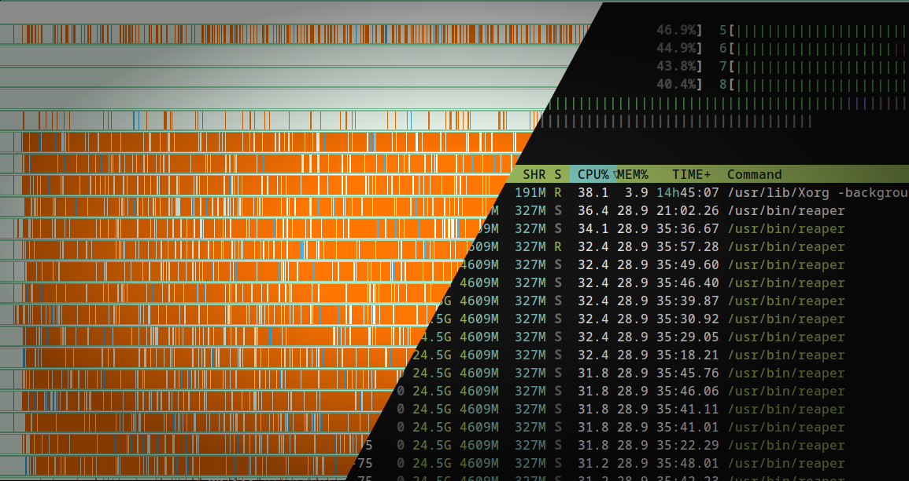
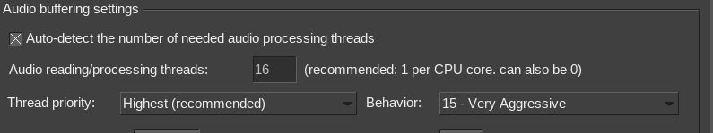
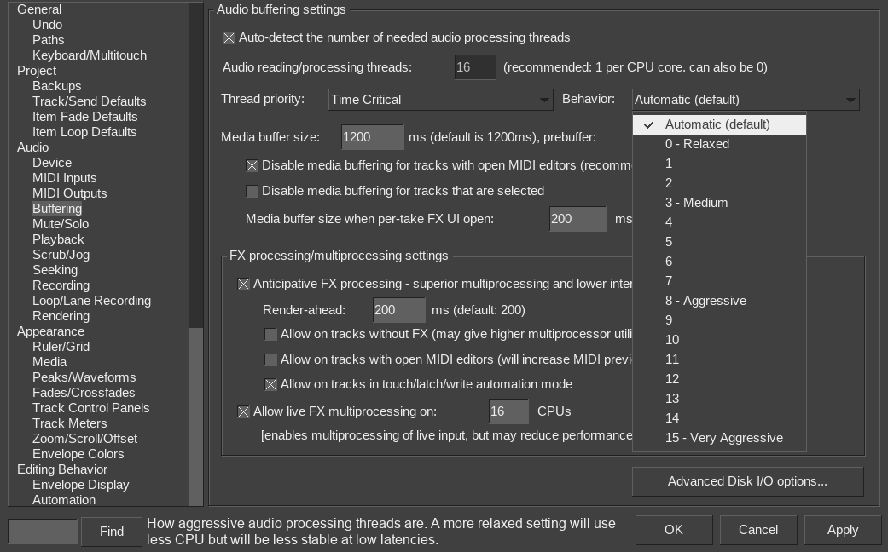
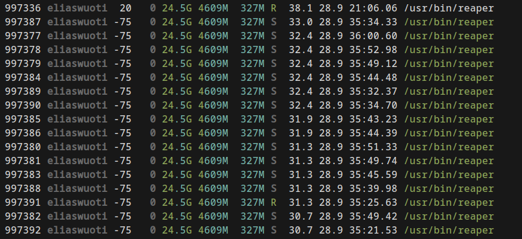
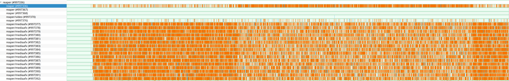
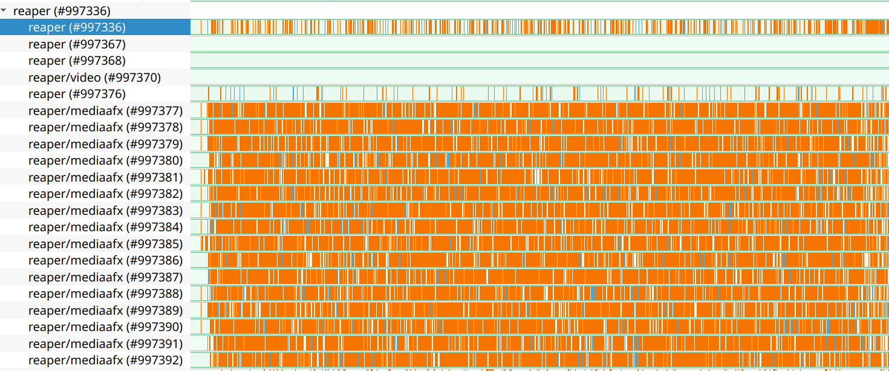
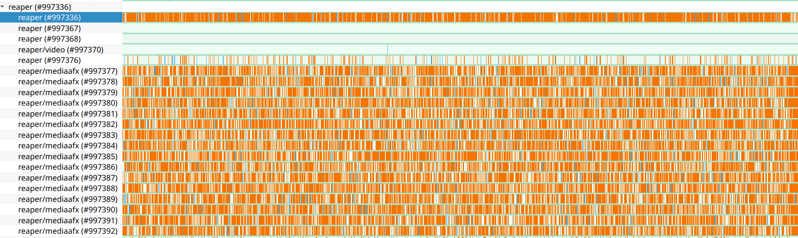

## Context

*To read more on Linux pro audio, [check the Arch wiki](https://wiki.archlinux.org/title/Professional_audio), for instance.*

I've been using Linux for audio production for the past 7 years right now. Despite the lack of plugins, things work great.

Well, except for one thing.

I get awful performance if I add my user to the `audio` group. This enables user-level processes to run with real-time  priorities. The privileges are defined in `/etc/security/limits.conf`:

```shell
@audio          -       rtprio          95
@audio          -       memlock         unlimited 
```

Well that's nice to know, but what about my performance issues? If I just leave my user out of the audio group, I get a relatively smooth UI in Reaper, but whenever I go record something my audio buffering just doesn't keep up, I get crackles on even moderately demanding instrument and effects chains.

In addition to being incredibly annoying in sound, the pops and crackles indicate that the audio buffer was not filled in time, forcing the playback to play an unfinished buffer. And unfinished buffer means some random, corrupt data which for sure won't sound good. And thus the pops and crackles.

So what to do?

Once RT privileges have been enabled, my CPU usages spikes through the roof. That's our first, simple clue.

## Sorry to interrupt you for a moment

I'm fortunate enough to have a reasonably powerful laptop with a similar setup. I check there and my user *does* belong to the audio group. CPU priorities also look good, so does overall performance. 

Also, I'm using an external USB soundcard on my desktop, which always creates slightly more latency than a laptop's integrated soundcard located directly in the PCI bus.

So where to start now?

Maybe `/proc/interrupts`? I could look at if there's some interrupts overlapping, that would for sure cause performance issues.  Let's keep an eye on that:


```sh
watch -n 0.1 cat /proc/interrupts
```

Here we can see the amount of interrupts done per CPU core and the source of the interrupt.
My CPU has 16 logical cores, each column here (`CPU0` to `CPU15`) corresponds to one of them. In the right hand side of each row, the cause of the interrupt is listed. 


```bash
Every 0.1s: cat /proc/interrupts                                                                                                                                                                                                                                                                                                                                   evo: Fri Sep  6 07:17:34 2024

            CPU0       CPU1       CPU2       CPU3       CPU4       CPU5       CPU6       CPU7       CPU8       CPU9       CPU10      CPU11      CPU12      CPU13      CPU14      CPU15
  67:  248836593          0          0          0          0   11855265          0          0          0          0          0          0          0          0          0          0  IR-PCI-MSI-0000:03:00.0    0-edge      xhci_hcd
  75:          0          0          0          0          0          0          0          0          0          0          0          0          0          0          0          0  IR-PCI-MSI-0000:22:00.0    0-edge      xhci_hcd
  84:       1843          0          0          0          0         74          0          0          0          0          0          0          0          0          0          0  IR-PCI-MSI-0000:25:00.2    0-edge      xhci_hcd
  93:      98317          0          0          0          0          0          0          0          0          0          0          0          0          0          0          0  IR-PCI-MSI-0000:26:00.3    0-edge      xhci_hcd
 101:   78365364          0          0          0          0    6339503          0          0          0          0          0          0          0          0          0          0  IR-PCI-MSI-0000:25:00.0    0-edge      amdgpu
 103:          0          0          0          0          0          0          0          0          0          0          0          0          0          0          0          0  IR-PCI-MSIX-0000:26:00.2    0-edge      psp-1
 104:          0          0          0          0          0          0          0          0          0          0          0          0          0          0          0          0  IR-PCI-MSIX-0000:26:00.2    1-edge      ccp-1
 105:        965   21803564          0          0          0          0          0          0          0          0          0      36720          0          0          0          0  IR-PCI-MSIX-0000:1e:00.0    0-edge      enp30s0
 107:          0          0          0          0          0          0          0          0          0          0          0          0          0          0          0       3021  IR-PCI-MSIX-0000:01:00.0   16-edge      nvme0q16
 109:          0          0          0          0          0          0          0          0          0          0          0          0          0          0          0          0  IR-PCI-MSI-0000:25:00.1    0-edge      snd_hda_intel:card0
 NMI:         80      11597      11992      11641      12004      11706      12020      11705      11969      11660      11964      11683      11951      11645      11974      11687   Non-maskable interrupts
 LOC: 1512622651  264903049  302009566  280517545  292627610  235121865  405351050  237000289  295252539  239082321  304910590  252729889  319355274  296553762  290293745  233191224   Local timer interrupts
 SPU:          0          0          0          0          0          0          0          0          0          0          0          0          0          0          0          0   Spurious interrupts
 PMI:         80      11597      11992      11641      12004      11706      12020      11705      11969      11660      11964      11683      11951      11645      11974      11687   Performance monitoring interrupts
 IWI:        275        385          9          5        249         12         22        230         19          5          9         88         12         11         13        272   IRQ work interrupts
 RTR:          0          0          0          0          0          0          0          0          0          0          0          0          0          0          0          0   APIC ICR read retries
 RES:    3758737    5312168    3792978    3273848    3851267    3382458    3971552    3438542    3144835    2680993    3172715    2759162    3262214    2862473    3398232    2956462   Rescheduling interrupts
 CAL:  297846172  315893124  334316813  333297576  335472530  331803379  338329861  339236161  336837902  342289427  337166079  337278432  346701463  347494507  341664458  354906342   Function call interrupts
 TLB:   17316479   16700260   17279616   16731805   17692213   17111019   17990114   17370089   18479647   18028922   17735578   17514137   17826721   17314256   18052571   17747879   TLB shootdowns
 TRM:          0          0          0          0          0          0          0          0          0          0          0          0          0          0          0          0   Thermal event interrupts
 THR:          0          0          0          0          0          0          0          0          0          0          0          0          0          0          0          0   Threshold APIC interrupts
 DFR:          0          0          0          0          0          0          0          0          0          0          0          0          0          0          0          0   Deferred Error APIC interrupts
 MCE:          0          0          0          0          0          0          0          0          0          0          0          0          0          0          0          0   Machine check exceptions
 MCP:        879        853        853        852        852        852        853        853        853        853        854        855        855        855        855        855   Machine check polls
```


One of the highest sources is `amdgpu`. Well, that's my GPU, so that's expected.

The soundcard on my PC is connected via a USB 3.0 port, so the source of interrupts for it is `xhci_hcd` . The interrupts caused by it are located in CPU0 and CPU5. So it's not spread really evenly. Even worse, interrupts by `amdgpu` are also mostly located in CPU0, so any audio handling done there is contested by handling graphcis calls.


Let's setup irqbalance to the background and take a look at the results again. `/proc/interrupts` gives us the following statistics:

```bash
Every 0.1s: cat /proc/interrupts                                                                                                                                                                                                                                                                                                                                evo: Fri Sep  6 07:43:06 2024

            CPU0       CPU1       CPU2       CPU3       CPU4       CPU5       CPU6       CPU7       CPU8       CPU9       CPU10      CPU11      CPU12      CPU13      CPU14      CPU15
  67:  249945864          0          0          0          0   11855265     445927          0          0          0          0          0          0          0          0          0  IR-PCI-MSI-0000:03:00.0    0-edge      xhci_hcd
  75:          0          0          0          0          0          0          0          0          0          0          0          0          0          0          0          0  IR-PCI-MSI-0000:22:00.0    0-edge      xhci_hcd
  84:       1843          0          0          0          0         74          0          0          0          0          0          0          0          0          0          0  IR-PCI-MSI-0000:25:00.2    0-edge      xhci_hcd
  93:      98317          0          0          0          0          0          0          0          0          0          0          0          0          0          0          0  IR-PCI-MSI-0000:26:00.3    0-edge      xhci_hcd
 101:   78779206          0          0          0          0    6339503          0          0          0     124678          0          0          0          0          0          0  IR-PCI-MSI-0000:25:00.0    0-edge      amdgpu
 103:          0          0          0          0          0          0          0          0          0          0          0          0          0          0          0          0  IR-PCI-MSIX-0000:26:00.2    0-edge      psp-1
 104:          0          0          0          0          0          0          0          0          0          0          0          0          0          0          0          0  IR-PCI-MSIX-0000:26:00.2    1-edge      ccp-1
 105:        965   21832732          0          0          0          0          0          0          0          0          0      38233          0          0          0          0  IR-PCI-MSIX-0000:1e:00.0    0-edge      enp30s0
 107:          0          0          0          0          0          0          0          0          0          0          0          0          0          0          0       3809  IR-PCI-MSIX-0000:01:00.0   16-edge      nvme0q16
 109:          0          0          0          0          0          0          0          0          0          0          0          0          0          0          0          0  IR-PCI-MSI-0000:25:00.1    0-edge      snd_hda_intel:card0
 NMI:         80      11710      12107      11753      12119      11820      12135      11819      12084      11774      12078      11796      12065      11758      12089      11801   Non-maskable interrupts
 LOC: 1523436646  266333753  303759324  281958156  294399628  236534259  407098297  238387095  296571707  240250179  306241263  253919155  320697239  297746898  291626477  234377989   Local timer interrupts
 SPU:          0          0          0          0          0          0          0          0          0          0          0          0          0          0          0          0   Spurious interrupts
 PMI:         80      11710      12107      11753      12119      11820      12135      11819      12084      11774      12078      11796      12065      11758      12089      11801   Performance monitoring interrupts
 IWI:        275        386          9          5        249         12         23        230         19          5          9         88         12         11         13        272   IRQ work interrupts
 RTR:          0          0          0          0          0          0          0          0          0          0          0          0          0          0          0          0   APIC ICR read retries
 RES:    3796590    5379566    3837739    3312638    3897533    3422601    4018063    3479823    3183580    2714077    3212495    2795388    3304022    2900512    3440744    2992330   Rescheduling interrupts
 CAL:  298922165  316927265  335481455  334354152  336621694  332821868  339466606  340234565  338128749  343757213  338486814  338765905  348015017  348957519  342947851  356437295   Function call interrupts
 TLB:   17327878   16711968   17294573   16755631   17707670   17129665   18003681   17384230   18493251   18041659   17750223   17529094   17842667   17327283   18067114   17763520   TLB shootdowns
 TRM:          0          0          0          0          0          0          0          0          0          0          0          0          0          0          0          0   Thermal event interrupts
 THR:          0          0          0          0          0          0          0          0          0          0          0          0          0          0          0          0   Threshold APIC interrupts
 DFR:          0          0          0          0          0          0          0          0          0          0          0          0          0          0          0          0   Deferred Error APIC interrupts
 MCE:          0          0          0          0          0          0          0          0          0          0          0          0          0          0          0          0   Machine check exceptions
 MCP:        884        858        858        857        857        857        858        858        858        858        859        860        860        860        860        860   Machine check polls
 ```

 Now the interrupts caused by the soundcard are handled on CPU6, while the GPU interrupts are handled in CPU9. So success?

 Not quite. Now audio latency is just fine, but the UI performance is still at a point of being unusable.


## Never underestimate the user in the dumbness of their configuration

 Interestingly, one thing which I did not take into account is how the audio applications handle their improved rights of allocate real-time system resources. Sometimes they can be configured quite thoroughly. Reaper for instance allows for quite a large amount of options regarding audio buffering.

This is all nice when you know what you're doing, but sometimes you just don't know. And it seems like past me was exactly like that.

Let's take a look at what options Reaper provides:



We have `thread priority` set to `highest` and `behavior` set to `15 - very aggressive`. Now that we have realtime enabled, if we let Reaper handle the audio buffering as aggressively as it can, the "other side", or the user interface will be left in the dust.

Changing the behavior back `0-relaxed` has dramatic effects: CPU usage is now basically identical to running without realtime privileges. What's more, when testing  



Same goes for overall CPU usage: when using `15 - very aggressive`, CPU gets to 80% usage while playback is on. However, when dialing it back to automatic, or `0 - relaxed`,  average CPU usage across all

When we have pre-emptive scheduling 

So why does this happen?

Simply put, it's the audio and UI threads competing for CPU time. The issue here is that when the audio threads get aggressive enough, with pre-emptive scheduling they will kick out any UI thread currently rendering. With this you 

As a dumb user my solution here was to remove my user account from the audio group altogether, which caused Reaper to no longer have access to real-time scheduling. With this change the audio processing threads would no longer kick out the UI threads, letting the UI respond to mouse actions quickly enough.

Also, the whole CPU usage was lower here as well.

But then I had problems with effects on MIDI input. I would play some notes on a MIDI keyboard, and the audio would start glitching, sounding horrible and unusable. The only option was to play less CPU-intensive plugins.

Let's think about this live instrument playing a little bit more. In this use case, you listen to the audio and all of your inputs happen on the external MIDI device. You might take a look at the UI a little bit, but I'm at least not using my mouse or keyboard at all. So any time spent refreshing the UI as fast as possible is wasted. But now that the audio threads can't kick out any UI threads from using the CPU, they are forced to wait. And they wait a little too long, finally causing glitches in playback when their requests are not handled in time.


## Performance profiling

To prove my hunch right, let's open some Linux profiling tools.

Starting with the simplest, let's open `htop`. The main thing we're interested in are the Reaper's threads and their CPU usages.



There's multiple threads with negative priorites, which means that they run in realtime. In addition to these the interesting bit is therad `997336`, which has a priority of only `20`, meaning that it's non-realtime. This the thread which renders the UI. If this thread is starved of CPU time, it will show up as the terrible UI lag I described previously.

Now that we know the threads, we can do some profiling on them. Let's record 30 seconds of profiling data with perf.

```bash
sudo perf record -F 99 -a -g -- sleep 30
```

During the recording, I'll toggle between two modes of Reaper's audio buffering settings: `0-relaxed` and `15-very aggressive`. 

The run is started with aggressive settings, after which in the middle I switch to the relaxed setting. In the end, I'll switch back to the aggressive setting one last time.

### Visualization

For visualization I'm using [hotspot](https://github.com/KDAB/hotspot), an excellent GUI visualizer for `perf` data.



In the image we have a rough list of Reaper threads and their respective CPU usage. The x-axis illustrates the time elapsed.

The thread `997336` is the UI thread, while the others below it are the audio processing threads. In the visualization, orange means that the thread in question is consuming CPU, while white means that the thread is not consuming CPU.

Zooming in to the left-hand side, you can see how all much orange all the audio threads have.



But once we move to the middle, the UI thread starts to get more orange. Here the audio threads start to have more white gaps in them, meaning that they spend less time hogging the CPU, giving the UI thread sufficient time to render the UI.



### Lessons learned: watch a little bit what your applications are doing

But why did this matter at all? In an audio production application the only thing which matters is the speed at which it can process the audio, right?

Well, depends on your use cases. In terms of performance, you only need your application to handle the current workload, no more, no less.

Sure, you could decrease the size of the audio buffer you're using, and thus get lower latencies. But if a moment later you're only doing arrangement work, you won't have much of a need for super-low latencies. Instead what you want is a snappy, responsive UI. Otherwise you'll just get frustrated when the UI keeps lagging.

So if you don't get any audio buffering issues, there's no need to force the buffering any further. Instead, remember that everything is a compromise and you need to act accordingly.


