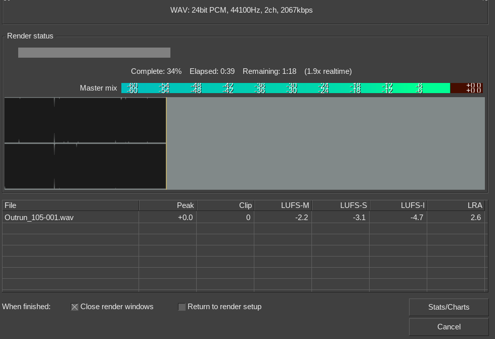
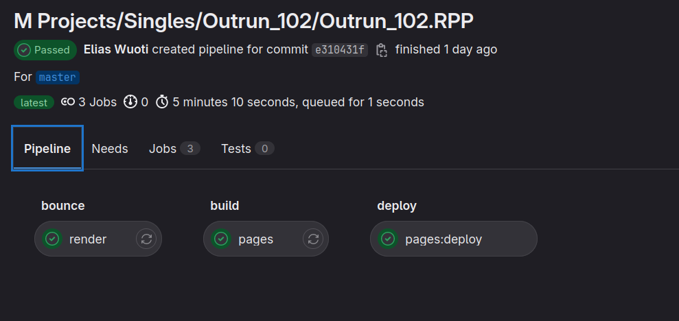
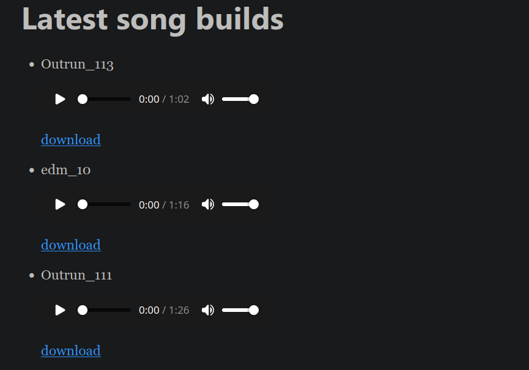

<!-- markdownlint-disable line-length -->

<i>When releasing new music, I've had the habit of notifying a friend of mine just after a new song hit Spotify. This continued for a while, and my friend joked about having exclusive access to my music pipelines, which I always found funny. </i>

But hold on for a second. Pipelines for music? As in CI ([Continuous Integration](https://www.atlassian.com/continuous-delivery/principles/continuous-integration-vs-delivery-vs-deployment)) pipelines? Could that work?

## Background

Nowadays most of music production happens 'in-the-box', using software referred to as Digital Audio Workstations (DAWs). DAWs to music are what Photoshop or Illustrator is to image editing. Or Premiere and Final Cut for video editing.

As with video editing, to get a finished product, you'll have to **render** it. In short, during the rendering the DAW goes through all the bits and pieces in your song and comes up with a nice audio file, which you can then listen to, send forward etc.

However, the rendering process takes a while. Here's a short example: on my 16-core AMD 1700x machine, a song with ~120 tracks is rendered in roughly 2 time faster than playing it back in real time. So for a four minute song you'll have to sit around and wait two minutes. 



But what if you want to render multiple projects at once, for instance an EP (~5 songs) or a full album (~10 songs)? Now you're talking of ~15 minutes being wasted.

Also, what if need to make a small edit and do a new revision? Do it all manually? **Every single time something changed?** I think that's the unfortunate reality for many music producers.

With that in mind, **CI pipelines for music** does make sense.

## What you'll need

So how do you get started? Well, it depends *a lot* on your DAW of choice. In this blog it's [REAPER](https://www.reaper.fm/).

In the context of CI pipelines (and Git), you'll either need:

- Small project files
- Lots of Git LFS storage

Luckily REAPER keeps its project files in plain text format:

```shell
<REAPER_PROJECT 0.1 "6.66/linux-x86_64" 1662197272
  RIPPLE 0
  GROUPOVERRIDE 0 0 0
  AUTOXFADE 129
  ENVATTACH 0
  POOLEDENVATTACH 0
  MIXERUIFLAGS 11 49
  PEAKGAIN 1
  FEEDBACK 0
  PANLAW 1
  PROJOFFS 0 0 0
  MAXPROJLEN 0 600
  GRID 3199 8 1 8 1 0 0 0
  TIMEMODE 1 5 -1 30 0 0 -1
  VIDEO_CONFIG 0 0 256
  PANMODE 3
  CURSOR 68.4
  ZOOM 8.9576804251499 0 0
  VZOOMEX 3 850
  USE_REC_CFG 0
  RECMODE 1
  SMPTESYNC 0 30 100 40 1000 300 0 0 1 0 0
  LOOP 1
  LOOPGRAN 0 4
  RECORD_PATH "" ""
  <RECORD_CFG
    ZXZhdxgAAA==
  >
```

This has the side effect of compressing really well, in addition to suiting a Git-oriented workflow. And I'm not the only one using git with REAPER. See more [here](https://vi-control.net/community/threads/using-git-for-daw-project-files.70709/) and [here](https://forum.cockos.com/showthread.php?t=102268).

So now you have a git repository full of project files. The next step is to set up some pipelines.

## Lots of plumbing to come up with

All CI services provide some ready-made runners, but in this case you need to build your own. A DAW isn't exactly high on the list of software to be included in CI runners, after all most of them are used for building software, rather than using it.

Luckily though, REAPER has some great feats:

- Portable ([12MB for a full DAW is rare to see](https://www.reaper.fm/download.php))
- Can be run without a graphical interface
- Provides command line options for rendering (`-renderproject`)

Just one problem though, your CI runner is likely going to need more than just your DAW.

### The road to dependency hell is paved with good intentions

Somehow, somewhere music production software evolved to use common standards instead of relying on out-of-the-box functionality.
Think of a common standard of using image processing filters across Gimp, Photoshop and others.

Most people refer to these simply as plugins. They come in various formats (VST, AU, CLAP) but they all introduce the same problem to our CI. Dependencies. And a lot of them.

And not just any dependencies. There's no centralized **store** for these. Most of them come as ready-built binaries in archives, which you're supposed to extract manually to your plugin directory. Well, some plugins might come with an `install.sh` script, but there's no guarantee.

This is where the problem appears for our builds. In addition to the base program (DAW) you're using, you'd also need to bundle all plugins with the main program.

Even though just a fraction of all plugins are available on Linux, I still have managed to download quite a few:


### Piping up your own CI runner

Now all we need is a machine to do our builds. Packaging and installing all plugins to a CI-provided runner, or god forbid inside a container sounds like pure madness.

#### The (almost) good part

A more straightforward way is to rent a server somewhere, install your DAW, plugins, and a CI runner agent there. This way you'd have your custom server hooked up to the CI service, ready to run builds. Sounds simple enough, right?

I went through this. You can copy your plugins reasonably easily, most of them are user-installed in `~/.vst` and `~/.vst3`. Copy these to the server and you'll have your plugins.

#### The bad

Just one thing: **licensing**. Most of (good) plugins require licenses of some sort. For instance, the [u-he](https://u-he.com/) plugins expect license files to be found on your home directory.

You could just copy the license files to the server in the same manner as you are copying your plugins, right?

I did this as well. And what a pain it was.

Most of the time GitLab CI agent runs as a different user for security reasons. With this, the home directory for the licenses is different than the user that you're configuring the server as.

For the time I was using the VPS to render the builds, there was always a very audible cracking sound in some parts of the songs. This is a common method for plugins to indicate they're being run in demo mode. Even though I copied the license files for **both** users, the issue still persisted.

All in all, what happens if some plugin just happens to go to a degraded state? How will you debug this?
 Are you going to install a remote desktop service to the machine? Start your DAW on the remote desktop connection and try opening the project there?

 What about if the server does not have the power to run your DAW in real time? Since rendering happens offline, it would make sense to get a relatively cheap server, it's not like your music pipelines need to be that fast. On the other hand, this doesn't even take in the account that the VM might not have a sound card available.

#### The really ugly

But wait, there's more problems. In addition to the missing licenses, the songs rendered **sounded** completely different. It's like there were some effects missing. So not only are paid plugins a problem, you also have to deal with individual plugins not loading on the server due to incompatible libraries, for instance.

With a lot of time wasted, there has to be a better option.

## A bit of local pipeline replacement

If you want to get your songs rendered **exactly** the way you would get them on your local machine, the best way is to render them on the **same machine** as you produce your music on.

Okay, so how to accomplish then? The rendering process still takes ~15 min and all of your CPU.

If you try to schedule this, you're going to be very surprised (or annoyed) by your CPU usage going to 100% at some point.

But maybe you can just run the builds every once in a while?

The only thing you'll lose is the quick feedback, but at least you have proper-sounding builds.

### The scripts

Let's start off with rendering the projects. Consider the following file structure of REAPER projects:

```shell
Projects
|--subfolder
   |--project1
   |--project2
   |--project3
   |--project4
```

A rendering script (`render_script.sh`) would look like this:

```bash
#!/bin/bash

# Define files you want to render
files=(\
    "./Projects/subfolder/project1/*.RPP" \
    "./Projects/subfolder/project2/*.RPP" \
    "./Projects/subfolder/project3/*.RPP" \
    "./Projects/subfolder/project4/*.RPP" \
)

# Project names can be different from the final rendered files
names=(\
    "project1" \
    "project2" \
    "project3" \
    "project4" \
)

# Make new WAV renders
for file in ${files[*]}; do reaper -ignoreerrors -renderproject "$file"; done

cd <RENDER_TARGET_DIRECTORY>

# Package the rendered files into MP3s
for file in ${names[*]} ; do ffmpeg -i "$file".wav -vn -ar 44100 -ac 2 -b:a 320k "$file".mp3 -y; done

# Clean runner files first:
rm <SHARED_RUNNER_DIRECTORY>/*.mp3

#copy all to folder shared with gitlab-runner
for file in ${names[*]} ; do cp "$file".mp3 <SHARED_RUNNER_DIRECTORY>; done
```

(Replace `<RENDER_TARGET_DIRECTORY>` with the folder your renders are located at, and   `<SHARED_RUNNER_DIRECTORY>` with the folder you can give the runner an access)

Lastly, I need something to populate my git commits. To be realistic, I'm never going to look at any commit messages, all I'm interested in that which files were changed. For this, you can use another script, `push_updates.sh`:

```bash
#!/bin/bash
changed_files=$(git status --porcelain)
git add Projects
git add Lyrics
git commit -m"$changed_files"
git push
```

The script builds a commit message from the current git status, giving you an automatic short summary on which projects were updated on that particular commit.

Now, you can run

```shell
./render_script.sh && ./push_updates.sh`
```

which renders all projects and pushes latest changes when rendering has finished. But we're not quite done yet.

#### Pipelines

Finally we get to the actual **pipelines** point of this. I'll only focus on GitLab CI since that's where this project is hosted.

First, setup some kind of YAML file for GitLab CI (`.gitlab-ci.yaml`):

```yaml
stages:
    - bounce
    - build
include:
    local: '.gatsby-build.yml'
render:
    stage: bounce
    tags:
        - reaper
    script: cp /<SHARED_RUNNER_DIRECTORY>/*.mp3 ./
    artifacts:
        paths:
            - ./*.mp3

```

The "bounce" step here really only publishes the MP3 files from the shared directory. After that, they can be used by the `build` stage.

#### Static site generation

The `build` stage is where the static site containing the songs is built. Here I'm using Gatsby, which has [good documentation for deploying to GitLab pages](https://www.gatsbyjs.com/docs/how-to/previews-deploys-hosting/deploying-to-gitlab-pages/).

Just for reference, here's how to embed MP3 files to the page. In `gatsby-config.js`, ensure you have this:

```js
  resolve: `gatsby-source-filesystem`,
  options: {
    name: `bounces`,
    path: `<SHARED_RUNNER_DIRECTORY>`,
  },
```

Where `<SHARED_RUNNER_DIRECTORY>` is again the folder you've shared with GitLab runner.

Next, in Index.js, you can display all of the files from Gatsby data with the following:

```js
{data.allFile.edges.map((file, index) => {
  return (
    <li key={`mp3-${index}`}>
      <p>
        {file.node.name}
      </p>
      <p>
        <audio controls>
          <source src={file.node.publicURL} type="audio/mp3" />
        </audio>
      </p>
      <a href={file.node.publicURL} download> download
      </a>
    </li>
  )
})}
```

Now that you have the pipeline, using the command `./render_script.sh && ./push_updates.sh` should result in a new pipeline run:



Which results in a website containing your songs:



----

### Jumping to conclusions

To sum it up, your ideas may be relevant, but execution matters. A lot. In this case, the resulting tooling is genuinely useful: I can listen to drafts of my songs whenever I need, albeit I have to remember to first create those renders every once in a while. Which isn't a tremendeous problem.

In fact, I've been using the current setup for 3 years now. Although the old revisions are long gone due to GitLab saving space on pipeline artifacts, if needed I can still run `git checkout` to some old revision and listen to the songs there.

One of the features that I also really enjoy is making a playlist of all the files found on the static site. But that's a post for another time.
