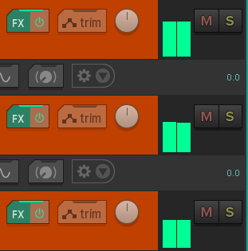
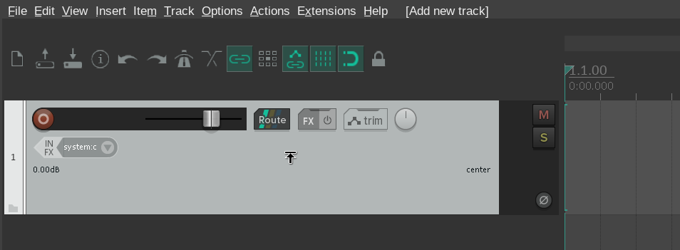

# Reaper on Wayland

## Context

Wayland has been getting ever so popular lately, but there's still quite a lot of software lacking native support for it. One of these is Reaper. It's what I use for music production.


However, in addition to the many things Reaper does well, turns out that the API it uses for UI rendering on Linux is open-source. It's available [here](https://github.com/justinfrankel/WDL/tree/main/WDL/swell) inside the WDL repository. And that's very convenient for the purposes of this post.

WDL contains a lot of features, but we're mostly interested in SWELL. It acts as a bridge between win32 API, allowing Reaper to run on Linux and Mac.

What happens under the hood in SWELL is that it uses GDK for displaying all the various UI windows, along wit Cairo for rendering.

But why doesn't it run on Wayland then? Let's find out.

## Getting started

First, let's replace the libSwell library used by our existing Reaper installation. Start by building SWELL with `make`:

```
cd WDL/WDL/swell
make DEBUG=1
```

After this, you have a `libSwell.so` library file in the current directory. Let's symlink it to Reaper so that is uses the newly built one instead of the default library it ships with:

```
cd <path_to_reaperl>
mv libSwell.so libsSwell.so.bak
ln -s <path_to_WDL_repo>/WDL/swell/libSwell.so libSwell.so
```

Next, ensure you have a desktop environment running on Wayland. For reference, I'm running Sway from a terminal on i3, my current window manager for X11. This makes prototyping Wayland work relatively easy without having to log on/off all the time. You know, commitment issues and all that.

### First launch

Launch Reaper with:

```bash
cd <path_to_reaperl>
GDK_BACKEND=wayland ./reaper
```

> `Segmentation fault: 11 (core dumped)`

Aaaaand we crashed. But that's expected.

There's a lot of behavior on SWELL which uses native X11 functions, such as getting the name of the current window manager. As the whole concept of a window manager is not valid on Wayland, we'll need to start branching things out.

Like when the focus is deactivated, the name of the desktop is queried here:

```cpp
static void on_deactivate()
{
  swell_app_is_inactive=true;
  HWND lf = swell_oswindow_to_hwnd(SWELL_focused_oswindow);
#ifdef GDK_WINDOWING_X11
    if (GDK_IS_X11_WINDOW (lf->m_oswindow))
      s_last_desktop = lf && lf->m_oswindow ? _gdk_x11_window_get_desktop(lf->m_oswindow)+1 : 0;
#endif
#ifdef GDK_WINDOWING_WAYLAND
    if (GDK_IS_WAYLAND_WINDOW (lf->m_oswindow))
      s_last_desktop = lf && lf->m_oswindow ? 0+1 : 0;
        
#endif
```

`_gdk_x11_window_get_desktop` is X11-specific, so that won't work. 

This feature isn't critical for now, so let's move on.

Or this one, here we're looking at the window manager name. The whole concept of a window manager doesn't exist on Wayland, but the closest thing is the compositor. In my case Sway. Sure, the might be a programmatic way of querying it but for now I'll just hard-code it:

```
if (GDK_IS_X11_DISPLAY (gdkdisp))
    wmname = gdk_x11_screen_get_window_manager_name(gdk_screen_get_default());
else
    wmname = "sway";
```


After quite a few of these changes, we finally get Reaper to start up:

A quick sanity check the list of current windows on sway and ensure Reaper is there:

```
swaymsg -t get_tree
```


This gives us 

```
#1: root "root"
  #3: output "X11-1"
    #9: workspace "1:web"
      #18: con "(null)"
        #28: con "(null)"
          #39: con "(null)"
            #42: con "(null)"
          #37: con "REAPER v6.82 <==BINGO
```

Alternatively, run `xprop` and hover the cursor on top of the Reaper's main window.

If running on X11 through xwayland, you would get a crosshair with xprop:


Whereas now on Wayland we get this:


In either case, we can see that Repaer is now running on Wayland.

### Screen updates are broken?

Now we start to get to the interesting bits. While browsing the UI, not a whole lot of the screen seems to update.
I can see the track layout and the playhead view, but scrolling does mostly nothing.

Here's the starting point when having 10 or so tracks:

TODO: Reaper started with broken screen updates image here

And here's the screen when it's scrolled to the bottom:

TODO: Reaper started with broken screen updates image here

Let's investigate this more.

#### How does it render?

First we'll need to find what actually draws the updates to the screen.
Since I'm on Linux, SWELL uses GDK and Cairo for drawing on the screen, and the functions are found in the file `swell-gdk-generic.cpp`

In `swell-gdk-generic.cpp`, there's two main points of calling Cairo's rendering functions, `swell_oswindow_updatetoscreen` and `OnExposeEvent`. `OnExposeEvent` is just an event handler for GDKs own `ExposeEvent`, which occurs when an GDK thinks an area needs to be redrawn on the UI.

In practice this means various hover events, like hovering over a button or some resize handle. Resizing any element also triggers this.

The `swell_oswindow_updatetoscreen` (I'll refer to it as just `updatetoscreen`) function on the other hand renders elements out of GDK's event loop, when the ReleaseDC call is made in `swell-gdi-lice.cpp`

TODO: read more on ReleaseDC on Win32 API docs.

In practice this means rendering the volume meters:



And the main playhead (the yellow vertical line which moves from left to right when you press play):


The volume meters and main playhead have to update much more frequently than any event would arrive.
Even when the user just is sitting still, you still need to update the playback position and the volume of individual tracks.
So drawing outside of the event loop s completely understandable.

But drawing outside the event loop  now keeps messing up everything on Wayland.

#### Debugging the screen updates

After commenting out everything in the `updatetoscreen` function, now the UI starts rendering somewhat properly.  Hover effects work and elements resized correctly.

But now none of the db meters, neither the playhead update when playback is started.
Well that's due to removing the rendering of those parts obviously.

But why did this happen? Think about a single expose event. You hover over one element once, the UI renders that element and that's it. 

Now think about the volume meters and the playhead. Those are updating *all the time*.

Since the `updatetoscreen` is called more frequently, chances are that immediately after an expose event it's time to render the db meters and the playhead.

```cpp
void swell_oswindow_updatetoscreen(HWND hwnd, RECT *rect)
```

The area updated is supposed to be restricted on just a small subset of the whole screen. That's the purpose of the GDK rectangle specified there.

Well what happens if we just override this? Let's take the measurements of the window like this:

```cpp
RECT cr;
cr.left=cr.top=0;
cr.right = hwnd->m_position.right - hwnd->m_position.left;
cr.bottom = hwnd->m_position.bottom - hwnd->m_position.top;
```

And use them to force GDK to render the whole area. 

```cpp
rect = &cr;

cairo_rectangle_int_t cairo_rect={rect->left,rect->top,rect->right-rect->left,rect->bottom-rect->top};

const cairo_region_t* rrr = cairo_region_create_rectangle(&cairo_rect);
GdkDrawingContext* context = gdk_window_begin_draw_frame(hwnd->m_oswindow, rrr);
```

Now the oswindow updates are not disturbing the hover events anymore.
All the volume meters now update, and scrolling works *somewhat*.

#### From no updates to infrequent updates

When pressing play, the playhead updates maybe once, and then nothing.
The playback continues, scroll and hover events work just fine.
But not the playback and volume meters.

So how to debug this?
Maybe color the rendered areas differently insde the `updatetoscreen` function?
Yeah, let's add that.

```cpp
#ifdef RAND_COLOR_OVERLAY
    auto r1 = ((double) rand() / (RAND_MAX));
    auto r2 = ((double) rand() / (RAND_MAX));
    auto r3 = ((double) rand() / (RAND_MAX));
    cairo_set_source_rgba(crc, r1, r2, r3, 0.5); 
    cairo_rectangle(crc, cairo_rect.x, cairo_rect.y, cairo_rect.width, cairo_rect.height);
    cairo_clip(crc);
    cairo_fill(crc);
    cairo_paint_with_alpha(crc, 0.1);
#endif //RAND_COLOR_OVERLAY
```

Simply put, this code takes 3 random values, one for red, one for blue and one for green.
These are then forwarded to Cairo, which allows us to overlay the region with a random color.

Lastly, we paint the whole surface with 10% transparency.
(*Should've seen my face when I painted the surface without any alpha, there wasn't anything to debug anymore.*)

Now when SWELL is compiled with the `RAND_COLOR_OVERLAY` you'll get to see some flickering lights whenever `updatetoscreen` is called.

Let's take a look at this on Wayland.
<video controls src='video/reaper_wayland.webm' width=100%/>
In the video I:

- Start the playback
  * The audio playhead starts moving, but occasionally it freezes
  * This is due to the `updatetoscreen` function not being called
- Resize the first audio track
  * This calls a separate function intended for resizing
  * Here the whole screen is set to be refreshed
  * And as such you get the playhead moving

But how does it look on X11? Like the following:

NOTE: This video contains rapidly flickering lights!
<video controls src='video/reaper_xorg.webm' width=100%/>

You can see how the playback area flashes constantly now that the refresh events are sent correctly, even if I'm not moving my mouse.

#### Thoughts on the rendering

Funnily enough, the rendering done in `OnExposeEvent` is very similar to rendering done in `updatetoscreen`. So what gives? Is there something on Wayland that prevents the `updatetoscreen` function from being called? Let's add some good old `printf` debugging and see how much spam we get in terminal:

Okay, a lot. The `updatetoscreen` function is called as expected (very frequently). So something **has** to prevent the contents from ending up on the screen?

I already overrode the rectangle to be my whole screen.
And it's not like the rendering breaks on X11, you saw from the previous video that it worked as expected.

Maybe let's dig down deeper to what are the **actual** differences between `OnExposeEvent` and `updatetoscreen` rendering? Maybe there would be something extra necessary to be done on Wayland to refresh the screen.

Well, not a whole lot. But instead of drawing peculiarities, what about the contents being drawn?
If you keep rendering the same contents over and over again, it doesn't matter how frequently your function is called.

#### What about the backingstore?

So what if the backing store is only updated when the `OnExposeEvent` is called?
TODO: what is even a backing store

Well, one of the interesting bits is resizing of Reaper's main window.
Here the playhead gets drawn to its correct position, once per resize.

So what gives?

The whole backing store gets destroyed and rebuilt. Maybe that's why?
TODO: backingstore recreation here?

#### No colors for me

But also, there shouldn't be any static colors on the playhead area, since assuming that `updatetoscreen` is called constantly.

So if there's a lot of calls to `updatetoscreen`, there should also be new random color combinations being drawn as well.

But if the color never changes, it's not like the bitmap contents are stuck internally. If this was the case, the playhead view would appear frozen but the color would keep flickering.
So the same image would be displayed but just with a different color overlay each time.

Since this is not the case it has to be in how the Cairo drawing context is handled in the `OnExposeEvent` function and in `updatetoscreen`.

Well just for fun, let's comment out the Cairo rendering calls from `OnExposeEvent`. Now we won't get any updates on mouse hovers etc. but we should still get the main playback view.

On Wayland, nothing.

But what about X11? Yes, the playback view still shows up.

So the issue is that the Cairo overlays go through somewhat, but they don't actually end up on the screen by the `updatetoscreen`.
Instead, they "wait" for the update to the next `ExposeEvent` to happen, after which the view which was rendered the last time shows up on the screen.
And that's why the flickering does not happen.

But what about the prints from the color overlay? They are still called on Wayland.
So there is *something* being colored, but it just never shows up.

My intuition says that there would be something wrong in the way Cairo rendering is used, making it not work on Wayland. But when it works just fine on X11, it does make me curious on what is really going on.

Maybe let's ask ChatGPT for (dumb) suggestions.

TODO: ChatGPT asking me to force invalidate the rectangle

It does actually work (somewhat): After calling `gdk_window_invalidate_rect()` in the end of `updatetoscreen`, suddenly the playback view starts renderng correctly.
There's no expose events being sent and it still updates.

But there's no color overlay now, which means that the `RAND_COLOR_OVERLAY` changes I did to `updatetoscreen` don't end up actually being rendered.

So maybe it's due to some missing flushing or something?

There's also a SWELL function which directly calls this, `swell_oswindow_invalidate`.


 
<!--

Now we're getting to the part where Reaper actually uses SWELL's APIs.
Since I don't have access to Reaper's source code, I can't just look at what does the calls to `updatetoscreen`.
-->

### Mouse events not being sent correctly?

Even after fixing the playhead view updates, there's still more issues on the screen updates.

All of the mouse hover elements aren't doing anything. For instance, when you hover your cursor over the `M` (mute) or `S` (solo) buttons, they're supposed to change to a slightly lighter color.

In addition, when hovering the mouse over Reaper's track control panel I get this:



The mouse is supposed to change it's indicator to a resize cursor at the bottom of that light grey are. And certainly not in the middle. Looks like we've got some very odd mouse offset going on.

Oh well, let's add some more prints. Here `m` is the mouse event as delivered by GDK. 

```cpp
POINT p2={(int)m->x_root, (int)m->y_root+Y_COORD_OFFSET};
printf("p2 x: %u y:p2.%u \n", p2.x, p2.y );
```
This results in the following:

```bash
p2 x: 6406 y:p2.1715 
p2 x: 6406 y:p2.1778 
p2 x: 6406 y:p2.1846 
p2 x: 6406 y:p2.1907 
p2 x: 6406 y:p2.1967 
p2 x: 6406 y:p2.2027 
p2 x: 6406 y:p2.2073 
```
Hold on, what? My desktop's resolution is 3840x2160, so the x coordinate is going off the charts.

That `p2` is coming from the GDK event `x_root` and `y_root`, interesting.

So since the coordinates are already weird coming from GDK, it's likely an environment issue and not me poking around SWELl's code.


Wait. Just to make sure, maybe I have something wrong in my environment?
That 6000px x coordinate would indicate that.
Well, my X screen does have that size due to two monitors, but I run Sway in a single window.
I think I have some scaling on, 1.25x for GDK and QT apps.
Not really related to Reaper, but Sway has this:
```
output DP-1 scale 1.2 
```

But since X11 doesn't have any scaling, I've configured Reaper separately to use 1.3x scaling:
TODO: reaper scaling options here

Maybe that could be it? 6400/3840 is ~ 1.67. The combined scale of 1.2 x 1.3 is 1.56, so we're not quite there yet.
``
1.2 * 1.3 * 3840 = 5990.4
``

Luckily I have a second monitor. So move sway there and start reaper, let's try again.

Oh. Now it works.


And what if I the whole `sway` window back to my main display?

Still working.

And what if I restart reaper while sway is running on the main display (DP-1)?

Broken again.

So Sway does handle the scaling somewhat automatically. But the problem is that since X11 (and win32 API for that matter) does not support scaling, there's all kinds of tricks done in SWELL to get it working.

So the solution is to start Reaper on a display without scaling and then move the window to the window with scaling. Got it.

Let's open Sway separately instead of inside X11 so that we get a proper look on this.
Ah, here the UI elements are much larger than before.

So GDK does some of its own scaling in addition to SWELL's scaling.

I have `output DP-1 scale 1.2`  in my Sway config.
To make matters even more complicated, I also have `Xft.dpi: 120` in my `.Xresources`.


<!--
I think I heard some harsh things on implementing scaling on win32. Maybe Reaper's forums or something. But I get it now.
-->

Unfortunately these screen updates aren't even the biggest problem, there's still more to come.

### Popups opening in incorrect places

Right now all popups and dialogs open at incorrectly on Wayland. Instead of appearing right where the mouse is, they are shown in the middle of the screen:


Maybe this has something to do with all the excluded X11-related functions?

Or maybe it's not GDK-related at all?
Let's start by looking at some windowing-related code. 

TOOD: swell-wnd-generic.cpp and SetWindowPos

Going to Swell, the
There's a reposflag
After this there's a `swell_oswindow_resize` function which in turn calls `gdk_window_move_resize` or `gdk_window_move`

```
  if ((reposflag&3)==3) gdk_window_move_resize(wnd,f.left,f.top,f.right-f.left,f.bottom-f.top);
```

Trouble is that the values here look correct, the coordinates at which the popup menu should be displayed are the same as the last mouse coordinates

Sidenote: to get quickly get the process ID of Reaper, let's run this:

```
ps aux | grep "./reaper" | grep -v "grep" | awk '{print $2}' | xclip -selection clipboard
```

A quick look in debugger gives me this:
```
*- f: {...}
    - left: 390
    - top: 245
    - right: 817
    - bottom: 989
```

And these were the last few mouse positions:

```
p1 x: 395 p1 y: 228 
p2 x: 400 p2 y: 263 
p1 x: 385 p1 y: 211 
p2 x: 390 p2 y: 246 
```

So the newly created popup or dialog should get placed right were the mouse is.

But it goes to the center of the screen.

Wait a moment, is this another environment issue? Maybe it's just Sway centering all floating dialogs?
Let's try the same on Gnome:


Nope. Still all over the place.
But hold on a moment. Shouldn't the position of the popup change relative to the position of Reaper's main window?

Well, depends on if it's a parent or a child window.

GDK docs had this:

> Repositions a window relative to its parent window. For toplevel windows, window managers may ignore or modify the move; you should probably use gtk_window_move() on a GtkWindow widget anyway, instead of using GDK functions. For child windows, the move will reliably succeed.

So maybe the popup dialogs are created incorrectly as toplevel windows?

A quick check reveals that there is a parent window:

```cpp
void swell_oswindow_resize(SWELL_OSWINDOW wnd, int reposflag, RECT f)
----
        if (parent == NULL) 
            printf("Toplevel\n");
        else
            printf("child \n");
```

But maybe it could be the dialog window not being set as a transient window?


There's this rather large section which decides whether or not the SWELL window is 

```cpp
          if (!(hwnd->m_style & WS_CAPTION)) 
          {
            if (hwnd->m_style != WS_CHILD && !(gdk_options&OPTION_BORDERLESS_OVERRIDEREDIRECT))
            {
              if (transient_for)
                gdk_window_set_transient_for(hwnd->m_oswindow,transient_for);
              gdk_window_set_type_hint(hwnd->m_oswindow, (gdk_options&OPTION_BORDERLESS_DIALOG) ? GDK_WINDOW_TYPE_HINT_DIALOG : GDK_WINDOW_TYPE_HINT_NORMAL);
              gdk_window_set_decorations(hwnd->m_oswindow,(GdkWMDecoration) 0);
            }
            else
            {
              gdk_window_set_override_redirect(hwnd->m_oswindow,true);
              override_redirect=true;
            }
            if (!SWELL_topwindows || 
                (SWELL_topwindows==hwnd && !hwnd->m_next)) wantfocus=true;
          }
          else 
          {
            GdkWindowTypeHint type_hint = GDK_WINDOW_TYPE_HINT_NORMAL;
            GdkWMDecoration decor = (GdkWMDecoration) (GDK_DECOR_ALL | GDK_DECOR_MENU);

            if (!(hwnd->m_style&WS_THICKFRAME))
              decor = (GdkWMDecoration) (GDK_DECOR_BORDER|GDK_DECOR_TITLE|GDK_DECOR_MINIMIZE);

            if (transient_for)
            {
              gdk_window_set_transient_for(hwnd->m_oswindow,transient_for);
              if (modal)
                gdk_window_set_modal_hint(hwnd->m_oswindow,true);
            }

            if (modal) type_hint = GDK_WINDOW_TYPE_HINT_DIALOG;

            gdk_window_set_type_hint(hwnd->m_oswindow,type_hint);
            gdk_window_set_decorations(hwnd->m_oswindow,decor);
          }

```

Adding this line manually didn't solve the issue either

```cpp
    gdk_window_set_transient_for(hwnd->m_oswindow,transient_for);
```

With WAYLAND_DEBUG=1 we get the following:

```
Move and resize to x: 1121 y: 632 width: 170 height: 22 
child 
[1138839.067] {Default Queue}  -> xdg_toplevel#37.set_min_size(170, 22)
[1138839.073] {Default Queue}  -> xdg_toplevel#37.set_max_size(170, 22)
```

There's also this:
```
xdg_surface#39.get_toplevel(new id xdg_toplevel#31)
xdg_toplevel#31.set_parent(nil)
xdg_toplevel#31.set_title("reaper")
xdg_toplevel#31.set_app_id("reaper")
wl_surface#40.commit()
org_kde_kwin_server_decoration_manager#11.create(new id org_kde_kwin_server_decoration#34, wl_surface#40)
org_kde_kwin_server_decoration#34.request_mode(1)
```

So no parent is even set for this window?

In fact I used `GdkWindow *parent = gdk_window_get_parent(wnd);` to retrieve the parent window.

Looking at how SWELL treats this new hwnd we there's this:

```
  - hwnd: 0x3de2f3e0
   *+ m_classname: 0x726e9f6f396f "unknown"
   *- m_oswindow: 0x0
   *+ m_title: 
   *+ m_children: 0x0
   *+ m_parent: 0x0
```

```cpp
    GdkRectangle frame;
    gdk_window_get_frame_extents(parent, &frame);
```

Here the frame is also empty.

So for SWELL the popup is a child window but in Wayland terms there's a new toplevel window being created.

So by definition it does not have a parent window. How to act on Wayland?

For a quick hack, we could attempt to retrieve the main Reaper window somehow.

For right-click and other popup menus, they are created in swell-menu-generic with the following code:

```cpp
int TrackPopupMenu(HMENU hMenu, int flags, int xpos, int ypos, int resvd, HWND hwnd, const RECT *r)
```


```cpp
HWND hh=new HWND__(NULL,0,NULL,"menu",false,submenuWndProc,NULL, hwnd);
```

Here the first parameter is left unassigned. And the TrackPopupMenu even already takes a window handle as an argument. So let's just use it as the parent of this new menu: 

```cpp
  HWND hh=new HWND__(hwnd,0,NULL,"menu",false,submenuWndProc,NULL, hwnd);
```

```
  1000: libSwell.so!swell_oswindow_resize(SWELL_OSWINDOW wnd, int reposflag, RECT f)@swell-generic-gdk.cpp:2241
  1001: libSwell.so!swell_oswindow_manage(HWND hwnd, bool wantfocus)@swell-generic-gdk.cpp:749
  1002: libSwell.so!ShowWindow(HWND hwnd, int cmd)@swell-wnd-generic.cpp:1085
  1003: [Unknown/Just-In-Time compiled code]@<unknown>:0
  1004: libSwell.so!SendMessage(HWND hwnd, UINT msg, WPARAM wParam, LPARAM lParam)@swell-wnd-generic.cpp:361
  1005: [Unknown/Just-In-Time compiled code]@<unknown>:0
  1006: libSwell.so!SendMessage(HWND hwnd, UINT msg, WPARAM wParam, LPARAM lParam)@swell-wnd-generic.cpp:361
  1007: libSwell.so!SWELL_RunMessageLoop()@swell-wnd-generic.cpp:888
```

The `SendMessage` function is called two times, first for the parent window and then a second time for the child window.


But mouse hover popups won't still appear at the correct place. 

### X won't give it to you

Let's add a plugin to a new track. Specifically a 3rd party VST.

> `Segmentation fault: 11 (core dumped)`

Ah, crashed again. Better get used to it.
The issue in this case is that there's already quite a bit of trickery going on in SWELL to even enable embedding plugin windows inside Reaper.

The problem is mimicking that behavior on Wayland. On X you have access to a global server which gives you information on any other processes windows.
Whereas in Wayland (in being more secure) you can't exactly just point at a process ID and then start messing around with its various windows.

To enable similar behavior on Wayland, Reaper would have to act as a Wayland compositor in addition to everything else it does.

So your application also kind of acts like a window manager, or a separate desktop environment.

There's some interesting work related to this made by presonos (TODO: link here)

But as there's not much progress being made, I assume the scope for that goes way beyond me and my small blog post.

But there's still things we can do.

#### Swell and CreateBridgeWindow

The bridging function is quite long, but here's a short summary on it:

- Create an empty X11 window
- Create a GDK window from that
- Assign a callback function (for resizing and other operations)
- Send the newly created bridge window forward

So what do do on Wayland? Instead of attempting to implement a full Wayland compositor inside someone else's APIs, we'll use some XWayland trickery instead.

This isn't nearly as bad of an option as it sounds since when dealing with DAW plugins means you've got hundreds of different pieces of software.
The selection of Linux-compatible plugins isn't exactly huge to begin with, so there's no need to break compatibility with even the few ones which exist.

So let's implement the following:

- Create a "placeholder" GDK window which we feed onto existing SWELL functions
    * This is equivalent to the real plugin bridge window being created on X
- Also create a raw X11 window using XLib
- Use that XLib window as a parent for the plugin window which appears
- XWayland will automatically create a Wayland window for this plugin X11 window

Okay, the last bit is something I didn't actually implement. It's something that would be really nice, but it rather reeks of edge cases and headaches.
So for the purposes of this blog post, let's just create those X11 windows anyway and leave their control to XWayland.

Okay, let's try again.


