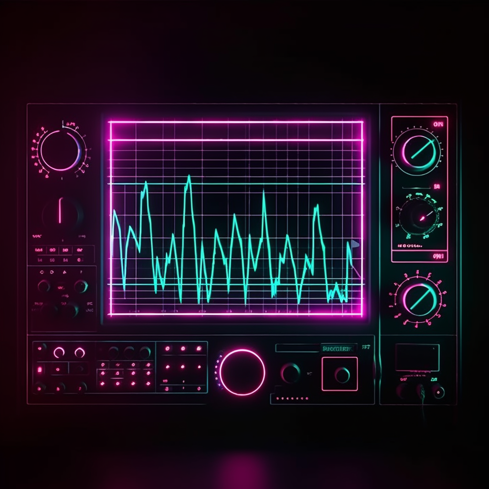

<!-- markdownlint-disable line-length -->



**NOTE: if you want to see results only, skip to the 'Results' section.**

Progression in generative AI has made quite some leaps during the past year. You've seen the image generation, conversing chat AIs and vastly improved speech modification AIs. But what about generative AIs for music?

Well, progress has been varying. There's [Riffusion](https://github.com/riffusion/riffusion), which is based on Stable Diffusion trained on song spectrograms. Riffusion was the first major attempt at generative AI for music. However, being based on generative AI for images (Stable Diffusion), limits it too much though: the songs have a distinctive sound reminiscent of low bitrate MP3s.

On the other hand, [MusicLM](https://google-research.github.io/seanet/musiclm/examples/) is also available, but really only in Google's research papers:  Neither the models **or** the training code are public, so open-source communities, such as [open-musiclm](https://github.com/zhvng/open-musiclm) and [musiclm-pytorch](https://github.com/lucidrains/musiclm-pytorch), have made efforts of varying quality to try replicating the results. Like Google's code though, training OpenMusicLM would take days on any conventional system. The project does offer checkpoints, but they are highly complex to use and expose too much of the internal workings system. Even though the checkpoints setup is complex, doesn't really result in any practical results. So no luck either way.

But then there's Meta's [AudioCraft](https://github.com/facebookresearch/audiocraft), or more precisely the [MusicGen](https://github.com/facebookresearch/audiocraft/blob/main/docs/MUSICGEN.md) part of it. Just like people thought that GPT-4 showed "sparks of AGI", MusicGen shows some sparks of AI-created music becoming a serious reality.

Well, if it only was truly stereo. Right now it's mono-only, and although there are [forks which contain](https://github.com/GrandaddyShmax/audiocraft_plus) "stereo" audio generation, it's more akin to applying regular DSP effects to widen a mono signal to stereo than true stereo. All in all, the results won't be something you'd like to actually listen all the time, but for a demo it's really impressive.

Despite all that, the best thing is that ***you can run AudioCraft locally***. And it's not even that complicated.

----

## Local installation

To get started, first clone the AudioCraft repository somewhere:

```bash
git clone https://github.com/facebookresearch/audiocraft.git
```

Next, ensure you have a new, clean virtual environment

```bash
python3 -m venv .venv
source .venv/bin/activate
```

**NOTE: If you have an AMD GPU, install ROCm-versions of pytorch:**

```bash
pip3 install torch torchvision torchaudio --index-url https://download.pytorch.org/whl/rocm5.4.2
```

Install the repository as a symlinked module:

```bash
pip install -e .
```

To my surprise, MusiGgen works just fine even though [xFormers does not support ROCm](https://github.com/AUTOMATIC1111/stable-diffusion-webui/discussions/3949). This is also the reason you'll get the error message when running the script on an AMD GPU:

> WARNING[XFORMERS]: xFormers can't load C++/CUDA extensions. xFormers was built for:
>   PyTorch 2.0.1+cu118 with CUDA 1108 (you have 2.0.1+rocm5.4.2)
>   Python  3.10.13 (you have 3.10.12)
> Please reinstall xformers (see https://github.com/facebookresearch/xformers#installing-xformers)
> Memory-efficient attention, SwiGLU, sparse and more won't be available.
> Set XFORMERS_MORE_DETAILS=1 for more details

But like any true end user, we can't read error messages. So let's see if we get some results out despite the errors.

## Prompting

None of the models (Riffusion, MusicLM, MusicGen) really support vocals, so let's focus on creating instrumental music. All we need now is a genre to evaluate? I'll pick [Synthwave/Retrowave](https://en.wikipedia.org/wiki/Synthwave), since it has relatively static compositions.

Since I'm running this locally on my own PC, I'm only constrained by GPU memory, patience and my electricity bill. As long as I have a long enough list of prompts, I can leave my PC running and return to multiple albums (although with very short songs) worth of music.

But first, we need some prompts. And a lot of them. So let's generate them with ChatGPT:

>I have a music-creating AI which creates songs based on prompts. I want to hear 80s inspired retrowave, but need a series of prompts to create the music from. Create me 100 prompts in .csv form for 80s retrowave music.

Funnily enough, GPT-3.5 only gave me 70 prompts. But that's still more than enough. Let's  paste them to a CSV file:

```csv
Prompt
1, "Create an 80s retrowave track with an upbeat tempo and a catchy synth melody."
2, "Imagine an 80s neon-lit cityscape at night and translate it into a full retrowave track."
3, "Design a complete retro-futuristic 80s retrowave track with nostalgic vibes."
4, "Compose a full retrowave track with a driving rhythm, pulsating bass, and punchy drums."
5, "Incorporate classic analog synth sounds reminiscent of the 80s into a complete track."
6, "Give the full track a dreamy, cinematic quality with ethereal pads and arpeggios."
7, "Channel the spirit of iconic retrowave artists like Kavinsky and Mitch Murder in a complete track."
8, "Create a complete track that captures a futuristic atmosphere with cosmic sound effects."
9, "Inspired by VHS aesthetics, make a complete lo-fi retrowave track with a vintage vibe."
10, "Design a dynamic chord progression for an entire retrowave track that captures the essence of the 80s."
11, "Experiment with vocoder vocals for the entire track, giving it a robotic, retro touch."
12, "Imagine a high-speed chase scene and compose the complete soundtrack for it in retrowave style."
13, "Infuse the complete track with a sense of nostalgia for the 80s era."
14, "Conjure a complete sense of optimism and adventure in the entire retrowave track."
15, "Incorporate elements of cyberpunk aesthetics into the full retrowave sound."
16, "Emulate the iconic FM synthesis of the 80s in melodies throughout the track."
17, "Create a complete blend of electronic and acoustic instruments for a unique retrowave twist."
18, "Take inspiration from retro video game music and create a complete track with a nostalgic twist."
19, "Design a breakdown in the middle of the track that transports the listener to a virtual reality."
20, "Make the listener feel like they're cruising in a DeLorean through time with a full retrowave track."
21, "Utilize vintage drum machines throughout the entire track for an authentic retro beat."
22, "Think of a retro-futuristic love story and compose its complete retrowave soundtrack."
23, "Introduce a saxophone solo in the full track for that smooth, jazzy retrowave touch."
24, "Blend elements of Italo disco with retrowave for a danceable and complete track."
25, "Emulate the warm, analog tape sound of the 80s throughout the entire track."
26, "Create a complete intro that sets the stage for a cosmic retrowave adventure."
27, "Capture the essence of Blade Runner in a full retrowave track."
...
```

**(Download [prompts.csv here](https://gist.github.com/wwuoti/1d402a3dd3a4f4d168d90bc564948100))**

To be honest, a lot of the prompts here aren't that good, but luckily it doesn't matter that much: In my experience, song quality is not really correlated to prompt quality.

In fact, the song-prompt correlation of MusicGen is very vague at times. You also might get some hot garbage with a reasonable prompt. The worst part is that you can get two completely different results with the same, making it extra tough to do any kind of prompt-engineering.

### Using MusicGen

To start, we need to parse our prompt CSV file:

```python
descriptions = []
csv_file = args.csv_file
duration = args.duration

with open(csv_file, 'r', newline='') as file:
    csv_reader = csv.reader(file, delimiter=",", quotechar='"')
    for row in csv_reader:
        prompt = row[1]
        descriptions.append(prompt)
```

Funnily enough, for some reason ChatGPT refused to remove the space between the comma and the prompt, giving me some `TypeError: "delimiter" must be a 1-character string`-headaches. A quick `%s/ "/"/g` in Vim fixed the issue in a scope-appropriate manner.

The model I'm using is [MusicGen's medium-size model](https://huggingface.co/facebook/musicgen-medium).  This is the sweet spot for local generation, where with a 16 Gb GPU you can still generate ~30 seconds songs.

**NOTE: when using AudioCraft from Python, the model will be automatically downloaded.**

Now for running the model against the prompts, we simply need to iterate the prompts in the `.csv` file, make a folder for the result files and give those to MusicGen:

```python
# Load medium-size model
model = MusicGen.get_pretrained('facebook/musicgen-medium')
model.set_generation_params(duration=duration)

folder_path = csv_file.split(".")[0]

# Create the folder if it doesn't already exist
folder = Path(folder_path)
if not folder.is_dir():
    folder.mkdir(parents=True, exist_ok=True)

for i in range(0, len(descriptions), 3):
    sliced_desc = descriptions[i:i+3]

    wav = model.generate(sliced_desc)

    for idx, one_wav in enumerate(wav):
        # Will save under {idx}.wav, with loudness normalization at -14 db LUFS.
        prompt = sliced_desc[idx]
        print(f"Rendering prompt {prompt}")
        audio_write(f'{folder_path}/{prompt}', one_wav.cpu(), model.sample_rate, strategy="loudness", loudness_compressor=True)
```

**The full Python script [is available here](https://gist.github.com/wwuoti/f9d91dffafb41a163c4ffd1016b83a1a).** Move the script and `prompts.csv` to your AudioCraft folder and run

```bash
python test_audiocraft.py --csv_file  `prompts.csv` --song_length 30
```

The output should then show:

```
Rendering prompt Create an upbeat retrowave track with a catchy synth melody.
Rendering prompt Imagine a neon-lit cityscape at night, and translate it into a retrowave sound.
Rendering prompt Design a retro-futuristic intro with nostalgic 80s vibes.
Rendering prompt Compose a driving retrowave rhythm with pulsating bass and punchy drums.
Rendering prompt Incorporate classic analog synth sounds reminiscent of the 80s.
Rendering prompt Give the song a dreamy, cinematic quality with ethereal pads and arpeggios.
Rendering prompt Channel the spirit of iconic retrowave artists like Kavinsky and Mitch Murder.
...
```

with the resulting files now located in `prompts/<prompt_name>.wav` within the AudioCraft folder.

**If you get out-of-memory errors, decrease the song length!** There's a large chance that if you don't have enough GPU memory, generating too long songs will crash the model.

## Results

Let's look at how the prompts sound. I won't cover all the prompts, but instead cherry-pick the best examples and the worst examples. MusicGen is not yet very consistent after all.

### The good

Some of the songs sound exceptional, especially considering its coming from a generative AI. Shifting through the material I'm constantly reminded how accurately generative AI mirrors the real world: to find the rare, really good songs, you have to dwell though an unmanageable amount of sub par content.

The best track to come out of this run is definitely this:

----

***Channel the spirit of iconic retrowave artists like Kavinsky and Mitch Murder.***

<audio controls>
  <source src="audio/Channel the spirit of iconic retrowave artists like Kavinsky and Mitch Murder.wav" type="audio/wav" />
</audio>
<br></br>

It **almost** sounds like a real song, and it could even pass ass menu music in some video game. Or even a short clip of a soundtrack. This is one of the only songs I really enjoy listening from a list of 100 prompts.

----

### The bad

Not every song is produced by AudioCraft is as good as the best one. Here's a few examples of that:

**Incorporate retro computer game sounds and bleeps into the composition..wav**

<audio controls class=full-width-audio>
  <source src="audio/Incorporate retro computer game sounds and bleeps into the composition..wav" type="audio/wav" />
</audio>
<br></br>

Now you could argue that it's the prompt, but honestly it should not be this bad. Bleeps and bloops are a standard feature of chiptune, and there's already Synthwave artists merging the two genres, like [LukHash](https://www.youtube.com/@lukhash).

----

**Emulate the sound of a vintage computer booting up**

<audio controls>
  <source src="audio/Emulate the sound of a vintage computer booting up.wav" type="audio/wav" />
</audio>  
<br></br>

This is even worse. Or depends on your musical taste really: if you enjoy noise music, maybe this sounds better to you than the other results. But even with that, there's some wacky-ass Mario Kart boogie going on as well, which makes the song hard to relate to.

The song has this very serious mood on one end, and completely mad at one end. With this in mind, I could see it being used in some comedic purpose. Not sure where though.

----

**Take inspiration from retro video game music for a nostalgic twist**

<audio controls>
  <source src="audio/Take inspiration from retro video game music for a nostalgic twist..wav" type="audio/wav"/>
</audio>
<br></br>

There's not much here that would remind me of retro video games. Well except a little bit of flute here and there, but outside of that it doesn't really conform to the prompt. To make matters worse, on the breakdown part (~0:25) of the song, there's some distorted, screeching elements. Maybe that's the AI screaming for mercy? Can't say for sure.

All in all, these songs are not something you'd want to spend too much time listening on.

## How does it perform against real songs?

Didn't exactly think that this would be a realistic question this soon. I've made a my fair share of Synthwave, so let's take a small comparison: compare an MusicGen-generated song to my own.

I had been producing music on a computer for ~4 years and just moved to producing Synthwave. The production is fairly amateurish, but not from a complete novice either. This should make it a reasonable starting point, since there quality won't be amazing (and thus giving AI the fair chance).

To make the comparison even, I'll use take a 30-second clip of my song, so that the songs are equal in duration. Also, I'll render it down to a mono mp3 with a bitrate of 128kbps, further degrading the quality. With that, the songs should have a similar sound.

Have a guess, which 30 second clip is from my song and which comes from MusicGen?

----

### Song 1

<audio controls>
  <source src="audio/Incorporate retro synthwave aesthetics into the album artwork..wav" type="audio/wav" />
</audio>

----

### Song 2


<audio controls>
  <source src="audio/ai_music_compare.mp3" type="audio/wav" />
</audio>

----

**The answer**: song 1 is MusicGen and song 2 is me. From a sound quality perspective, the two are closer than I initially expected. The dead giveaway is the unnatural rhythm in song 1, which could of course be made by a human, but compared to song 2 it's very apparent.

However, some of the elements in song 1 are much better than the elements in my song. I particularly enjoy the drums on song 1.

The reason for this? Presumably, AudioCraft is trained on a lot of music, and the absolute worst, bottom-of-the-barrel content might have not gotten into the training cycle. Instead, some more polished examples were chosen, resulting in better production quality than an amateur might achieve in several years.

That's quite something.

## Issues

AudioCraft does have its share of issues, but against all odds, all of them are related to the actual content and not to the platform/deployment engineering aspect of it. Considering other AI projects I've tried to deploy on my own machine, that's quite a remarkable achievement.

#### Reproducibility

The biggest issue is the non-deterministic nature of generative AI models for music. Right now the same prompt leads to two **completely** different outputs.

Consider the earlier example:

***Channel the spirit of iconic retrowave artists like Kavinsky and Mitch Murder.***

<audio controls>
  <source src="audio/Channel the spirit of iconic retrowave artists like Kavinsky and Mitch Murder.wav" type="audio/wav" />
</audio>
<br></br>

A second pass (with the same prompt), you get this result:

<audio controls>
  <source src="audio/Channel the spirit of iconic retrowave artists like Kavinsky and Mitch Murder_2.wav" type="audio/wav" />
</audio>
<br></br>


With this in mind, you could likely do with a lot less prompts too, but just rerun the audio generation over and over again. Well, maybe some other time.

#### Control

Music needs a lot of fine control, and text prompts just aren't good enough interfaces. This is the same problem as with other generative AI tools. However, music is arguably even harder to describe by just using words, so as long as the models use text as their primary input source, advances will be limited.

Another issue is that songs are first and foremost massive layers of tracks. Without the ability to tweak individual instruments/tracks inside a song.

## Future

This is where boring evaluation ends and wild speculation starts. One thing which these models focus (perhaps) too much on is generating music just from a text prompt. Or simple melodies.

The interesting bit is that in terms of production quality, MusicGen's output is actually pretty nice. I would argue that it would takes several years for a complete beginner to get this far in terms of production.

Another thing to note is the variety of genres it can produce. Typically producers are only good at specific niches, but MusicGen can produce practically anything (although with no vocals).

### AI is no Mozart (yet)

The problem is still the details in the composition. It sort of suffers from the same issue as most amateur musicians: the composition itself is not interesting enough. This might limit the impact of music AI for a longer period, since people will associate AI-created music being extremely mediocre and boring.

So how would you measure the composition quality? Well, current AI can't act as a music critique, so the closest thing is our own intuition. Or maybe a real music critic. Imagine the songs I showed you earlier played live by an orchestra. Or a small band at your local venue. Would you consider it good? Likely not.

### But AI could replace your producer

The opposite direction is where things start getting more interested: Let's assume that you're a great composer, but a not that good with computers. What happens when you can feed a draft of your song to the AI? Even right now MusicGen can take melodies as input and create a song based on that melody. It can even create the song in a completely different genre and make it sound like the melody was intended exactly for that specific genre in the first place.

While genre-hopping is all and nice, the real impact will come when you can feed complete songs to AI, and it will improve the song, but not change it. There's a huge amount of processing and effort dedicated to the various stages of production, from sound design to mixing and finally mastering. These take thousands of hours to get skilled at.

### The next Napster?

This will likely spark some big legal issues, since a lot of professionals mixing and mastering engineers have almost trademark-like sounds that they apply to their projects. Once AI is trained on their material and can transform amateur songs into professional, radio-ready hits, we'll start seeings some **real** disruption.

Just like with Spotify, there's no way record labels will be happy with the change. But unlike Spotify, they can't just purchase a stake in AI. And that's going to be a problem. And a story for another time.

